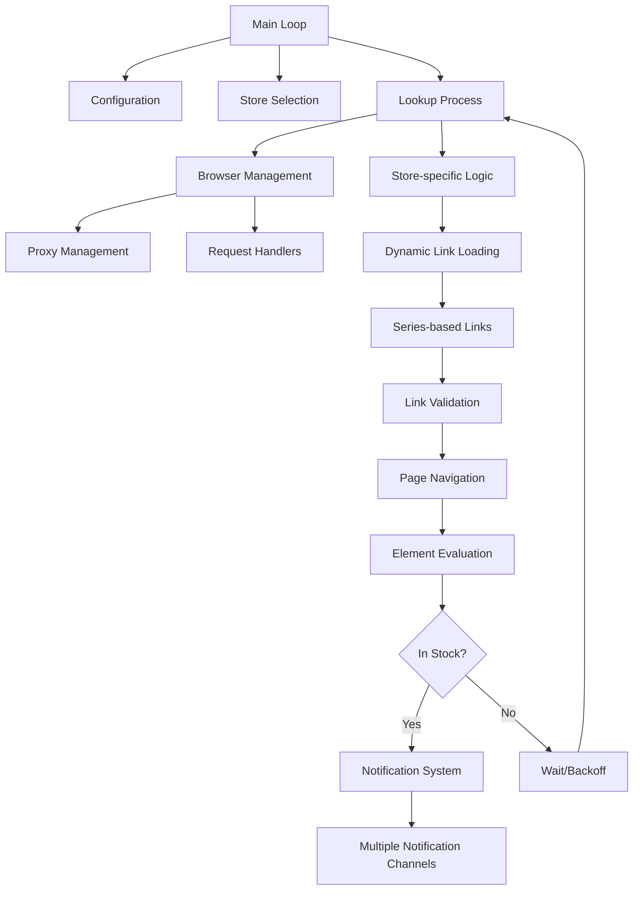

# Streetmerchant Architecture Documentation

This document provides an updated overview of the Streetmerchant architecture, detailing the core components, their interactions, and the application's design patterns.

## System Overview

Streetmerchant is a stock checking application that leverages browser automation to continuously monitor online retailers for product availability. The system is designed to be:

- **Modular**: Components are organized into logical modules with clear responsibilities
- **Extensible**: Easy to add new stores or notification channels
- **Configurable**: Highly customizable through environment variables
- **Resilient**: Handles network issues, timeouts, and rate limiting

## Core Components

### 1. Store Module (`src/store/`)

The Store module is responsible for defining how stock is checked across different retailers:

- **Store Models (`src/store/model/`)**: Each file represents a specific retailer and implements the `Store` interface
- **Series-Based Organization (`src/store/model/series/`)**: Product links organized by series (e.g., 3080, 3070) for better maintainability
- **Labels**: CSS selectors used to identify elements on the page that indicate stock status
- **Links**: Product URLs to check for each store
- **Link Validation**: Validates link structure to ensure proper formatting
- **Lookup (`src/store/lookup.ts`)**: Orchestrates the stock checking process across configured stores

### 2. Browser Management (`src/browser.ts`)

Responsible for managing Puppeteer browser instances:

- **Instance Management**: Creates and reuses browser instances for different stores
- **Page Configuration**: Sets up user agents, request interception, and cookie handling
- **Proxy Integration**: Applies proxy settings to browser instances
- **Error Handling**: Manages browser errors, including protocol timeouts
- **Resource Optimization**: Controls browser resource usage

### 3. Configuration (`src/config.ts`)

Centralizes application settings from environment variables:

- **Store Selection**: Controls which stores to monitor
- **Product Filtering**: Filters for specific brands, models, or series
- **Browser Behavior**: Controls headless mode, timeouts, and other browser settings
- **Notification Preferences**: Configures various notification channels
- **Proxy Settings**: Defines proxy configuration

### 4. Messaging (`src/messaging/`)

Dispatches notifications through various channels when stock is found:

- **Notification Manager (`notification.ts`)**: Centralized function for sending notifications
- **Channel Implementations**: Dedicated modules for each notification service (Discord, Email, Telegram, etc.)
- **Message Formatting**: Standardizes notification content across channels

### 5. Proxy Management (`src/proxy.ts`)

Manages proxy configuration and rotation:

- **Proxy Parsing**: Transforms proxy strings into usable configurations
- **Rotation Logic**: Implements proxy rotation to avoid detection
- **Store-Specific Proxies**: Supports different proxies for different stores

### 6. Request Handling (`src/handlers.ts`)

Intercepts and modifies network requests:

- **Resource Blocking**: Implements low-bandwidth mode by blocking certain resource types
- **Request Modification**: Adds necessary headers and cookies
- **Response Handling**: Processes and analyzes responses

### 7. Error Handling (`src/util.ts`)

Provides utilities for error management:

- **Error Filtering**: Determines which errors to log vs. ignore
- **Retry Logic**: Implements backoff strategies for failed requests
- **Protocol Error Handling**: Special handling for Chrome DevTools Protocol errors

## Series-Based Link Organization

The application uses a series-based organization system for product links:

- **Directory Structure**: Links are organized by product series (e.g., 3080, 3070) in dedicated directories
- **Dynamic Loading**: Store implementations load links dynamically based on active series
- **Selective Loading**: Only links for configured series are loaded, improving performance
- **Link Validation**: Validates link format and required fields to ensure data quality
- **Link Filtering**: Supports filtering by brand, model, and price

This approach improves code maintainability by:
1. Reducing the size of store files
2. Making it easier to add or update links for specific series
3. Providing better organization for large numbers of links
4. Enabling series-specific optimizations

See the [Series-Based Links Documentation](series-based-links.md) for more details.

## Data Flow



## Key Architectural Patterns

### 1. Strategy Pattern

Individual store implementations act as strategies, providing specialized logic for different websites while adhering to a common interface.

### 2. Dependency Injection

Browser instances and configuration are injected into components that need them, promoting loosely coupled code.

### 3. Observer Pattern

The notification system implements an observer pattern where stock events trigger notifications to multiple services.

### 4. Factory Method

Browser and page creation follows a factory method pattern, encapsulating the complexity of setting up properly configured instances.

### 5. Retry with Exponential Backoff

Network requests implement retry logic with increasing delays to handle transient failures and avoid rate limiting.

### 6. Dynamic Module Loading

Series-specific links are loaded dynamically based on configuration, improving performance and modularity.

## Recent Improvements

### Series-Based Link Organization

The new series-based organization system structures product links by series:

```typescript
// Series-specific link file (src/store/model/series/3080/amazon.ts)
export const links: Link[] = [
  {
    brand: 'nvidia',
    model: 'founders edition',
    series: '3080',
    url: 'https://www.amazon.com/nvidia-rtx-3080',
  },
  // More links...
];

// Store implementation with dynamic link loading
export const Amazon: Store = {
  // Store configuration...
  links: [], // Empty initial array
  setupAction: async (browser: Browser) => {
    // Load links for active series
    Amazon.links = await getSeriesLinks('amazon');
  },
};
```

This approach improves organization, performance, and maintainability.

### Protocol Timeout Enhancement

A configurable protocol timeout was added to prevent "Network.enable timed out" errors that could crash the application:

```typescript
const browser = await Puppeteer.launch({
  args,
  defaultViewport: null,
  handleSIGHUP: false,
  handleSIGINT: false,
  handleSIGTERM: false,
  headless: false,
  protocolTimeout: config.page.protocolTimeout, // Configurable timeout (default: 60s)
  ...options,
});
```

This setting determines how long Puppeteer waits for Chrome DevTools Protocol commands to complete, enhancing application stability.

### Enhanced Error Handling

Improved error filtering for protocol-related errors to prevent log pollution:

```typescript
// Error filtering in util.ts
const IGNORE_ERRORS_REGEXP = new RegExp(
  [
    'Connection closed',
    'Navigating frame was detached',
    'Requesting main frame too early',
    'Target\\.(attachToTarget|createTarget|(create|dispose)BrowserContext)',
    'TargetCloseError',
    'Protocol error',
    'Network\\.enable timed out',
    'Target closed',
  ].join('|')
);
```

## Future Considerations

As the application evolves, some architectural considerations for the future include:

1. **Microservice Architecture**: Potentially splitting components into separate services for better scaling
2. **Queue-Based Processing**: Implementing a queue for stock checking to better handle backpressure
3. **Serverless Functions**: Moving certain components to serverless for cost optimization
4. **Worker Threads**: Using worker threads for parallel processing of store checks
5. **WebSocket Integration**: Real-time updates to clients via WebSocket connections
6. **Series-Based Extension**: Extending the series-based architecture to other parts of the application