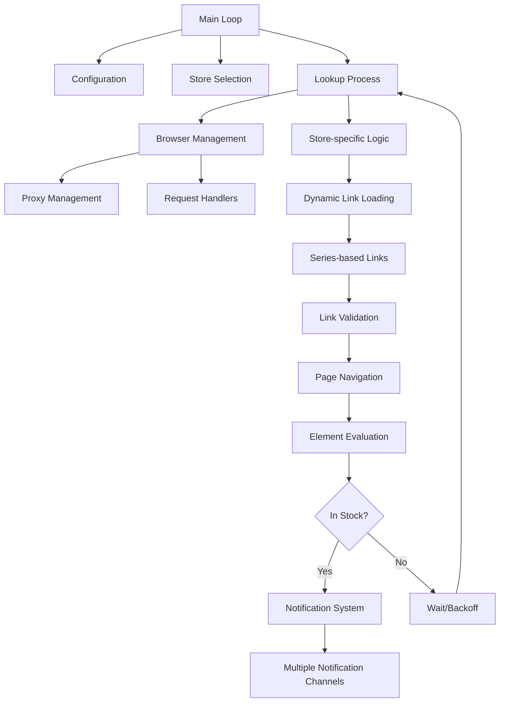

# Streetmerchant Architecture Documentation

This document provides an updated overview of the Streetmerchant architecture, detailing the core components, their interactions, and the application's design patterns.

## System Overview

Streetmerchant is a stock checking application that leverages browser automation to continuously monitor online retailers for product availability. The system is designed to be:

- **Modular**: Components are organized into logical modules with clear responsibilities
- **Extensible**: Easy to add new stores or notification channels
- **Configurable**: Highly customizable through environment variables
- **Resilient**: Handles network issues, timeouts, and rate limiting

## Core Components

### 1. Store Module (`src/store/`)

The Store module is responsible for defining how stock is checked across different retailers:

- **Store Registry (`src/store/model/registry/`)**: Centralized registry for all store configurations
  - Type-safe store creation through factory functions
  - Organized by region (US, EU, UK, CA, etc.)
  - Dramatically reduced duplication across store definitions
- **Store Models (`src/store/model/`)**: Legacy store files that are gradually being migrated to the registry
- **Series Data (`src/store/model/series-data.ts`)**: Centralized product link management system
- **Series-Based Organization (`src/store/model/series/`)**: Alternative product link organization by series
- **Labels**: CSS selectors used to identify elements on the page that indicate stock status
  - Modular label organization in `src/store/model/common/labels/`
  - Standardized label sets for common patterns (stock, price, captcha, etc.)
- **Links**: Product URLs to check for each store
- **Link Validation**: Validates link structure to ensure proper formatting
- **Lookup Modules (`src/store/lookup-modules/`)**: Modular approach to stock checking logic
  - Stock checking, captcha handling, response processing, etc.
- **Lookup Facade (`src/store/lookup-facade.ts`)**: Simplified interface for the lookup process

### 2. Browser Management (`src/browser/`)

A modular approach to managing Puppeteer browser instances:

- **Browser Session (`src/browser/session/`)**: Class-based approach to browser session management
  - Clear separation between browser creation and page operations
  - Better encapsulation of browser state and operations
  - Simplified interface for interacting with browser instances
- **Session Types (`src/browser/session/types/`)**: TypeScript interfaces for browser session operations
- **Session Utilities (`src/browser/session/utils/`)**: Helper functions for browser operations
  - Browser configuration
  - Page setup
  - Protocol error handling
  - CDP session management
- **Proxy Integration**: Applies proxy settings to browser instances
- **Error Handling**: Manages browser errors, including protocol timeouts
- **Resource Optimization**: Controls browser resource usage

### 3. Configuration (`src/config.ts`)

Centralizes application settings from environment variables:

- **Store Selection**: Controls which stores to monitor
- **Product Filtering**: Filters for specific brands, models, or series
- **Browser Behavior**: Controls headless mode, timeouts, and other browser settings
- **Notification Preferences**: Configures various notification channels
- **Proxy Settings**: Defines proxy configuration

### 4. Messaging (`src/messaging/`)

Dispatches notifications through various channels when stock is found:

- **Notification Manager (`notification.ts`)**: Centralized function for sending notifications
- **Channel Implementations**: Dedicated modules for each notification service (Discord, Email, Telegram, etc.)
- **Message Formatting**: Standardizes notification content across channels

### 5. Proxy Management (`src/proxy.ts`)

Manages proxy configuration and rotation:

- **Proxy Parsing**: Transforms proxy strings into usable configurations
- **Rotation Logic**: Implements proxy rotation to avoid detection
- **Store-Specific Proxies**: Supports different proxies for different stores

### 6. Network Management (`src/network/`)

Improved network request handling and management:

- **Request Handler (`src/network/handlers/request-handler.ts`)**: Class-based approach to request handling
  - Consistent API for different request types
  - Improved error handling and retry logic
  - Better separation of concerns
- **Handler Types (`src/network/handlers/types/`)**: TypeScript interfaces for request operations
- **Handler Utilities (`src/network/handlers/utils/`)**: Helper functions for network operations
  - Captcha detection and handling
  - Response status processing
  - Label matching utilities
  - Screenshot management
- **Resource Blocking**: Implements low-bandwidth mode by blocking certain resource types
- **Request Modification**: Adds necessary headers and cookies
- **Response Handling**: Processes and analyzes responses

### 7. Error Handling and Utilities

Improved error handling and utility functions:

- **Error Filtering (`src/util.ts`)**: Determines which errors to log vs. ignore
- **Logger System (`src/logger/`)**: Enhanced logging system
  - Modular organization of logging functionality
  - Message formatting utilities
  - Support for different log levels and formats
- **Retry Logic**: Implements backoff strategies for failed requests
- **Protocol Error Handling**: Special handling for Chrome DevTools Protocol errors
- **Configuration System (`src/config/`)**: Modular configuration management
  - Browser configuration
  - Page settings
  - Store options
  - Notification preferences
  - Proxy configuration

## Centralized Data Management

The application has transitioned to a centralized data management approach for store configurations and product links:

- **Store Registry**: All store configurations are managed in a central registry
  - Organized by region for easier management
  - Factory functions for creating different store types
  - Consistent type checking and validation
  - Simplified process for adding new stores

- **Centralized Product Data**: Product links are managed in a unified data structure
  - Single source of truth for all product information
  - Efficient filtering and retrieval mechanisms
  - Dramatically reduced file count and complexity
  - Easier programmatic manipulation

- **Incremental Migration**: Support for both legacy and new approaches
  - Gradual transition path for existing code
  - Compatibility layers for different data formats
  - Series-based organization still supported as an alternative

This approach improves code maintainability by:
1. Consolidating duplicate configurations and logic
2. Providing a single, consistent interface for store and product data
3. Enabling more powerful filtering and search capabilities
4. Simplifying the overall architecture and reducing file count
5. Making it easier to add new stores or products
6. Improving type safety and reducing errors
7. Facilitating better testing and validation

### Implementation Details

The centralized data management is implemented as follows:

1. **Store Registry Structure**:
   ```
   src/store/model/registry/
   ├── index.ts           # Main entry point for the registry
   ├── store-factory.ts   # Factory functions for creating stores
   ├── types.ts           # TypeScript interfaces for store registry
   ├── us-stores.ts       # US store configurations
   ├── eu-stores.ts       # European store configurations
   ├── uk-stores.ts       # UK store configurations
   ├── ca-stores.ts       # Canadian store configurations
   └── other-stores.ts    # Other store configurations
   ```

2. **Centralized Product Data**:
   - `src/store/model/series-data.ts` contains all product links
   - Structured as a nested object with series, brand, and model hierarchies
   - Includes essential product information (URL, price, etc.)
   - Functions for filtering and retrieving links based on various criteria

3. **Series-Based Modules**:
   ```
   src/store/model/series-modules/
   ├── index.ts           # Main entry point for series modules
   ├── data-access.ts     # Data access layer for series data
   ├── data-store.ts      # Storage and retrieval of series data
   ├── file-loader.ts     # File loading utilities
   ├── link-cache.ts      # Caching layer for link data
   ├── link-fetcher.ts    # Link retrieval functions
   ├── link-filter.ts     # Filtering mechanisms
   ├── link-filters.ts    # Predefined filters
   ├── link-types.ts      # TypeScript interfaces for links
   ├── series-api.ts      # Public API for series data
   └── types.ts           # Shared type definitions
   ```

4. **Legacy Support**:
   - The `auto-load-series.ts` module provides backwards compatibility
   - Series-based organization still supported as an alternative
   - Gradual migration path for transitioning to the new system

See the [Series-Based Links Documentation](series-based-links.md) for more details.

## Data Flow



## Key Architectural Patterns

### 1. Strategy Pattern

Individual store implementations act as strategies, providing specialized logic for different websites while adhering to a common interface.

### 2. Dependency Injection

Browser instances and configuration are injected into components that need them, promoting loosely coupled code.

### 3. Observer Pattern

The notification system implements an observer pattern where stock events trigger notifications to multiple services.

### 4. Factory Method

Browser and page creation follows a factory method pattern, encapsulating the complexity of setting up properly configured instances.

### 5. Retry with Exponential Backoff

Network requests implement retry logic with increasing delays to handle transient failures and avoid rate limiting.

### 6. Dynamic Module Loading

Series-specific links are loaded dynamically based on configuration, improving performance and modularity.

## Recent Improvements

### Centralized Store Registry

The new store registry system consolidates store configurations and improves maintainability:

```typescript
// Store registry implementation (src/store/model/registry/us-stores.ts)
import {createStore, createCommonLabels} from './store-factory';
import {StoreRegistry} from './types';

// Common label set for Amazon-style stores
const amazonLabels = createCommonLabels({
  inStock: {
    container: '.a-button-input[name="submit.add-to-cart"]',
    text: ['add to cart'],
  },
  outOfStock: {
    container: '#outOfStock',
    text: ['currently unavailable'],
  },
});

// Registry of US stores
export const usStores: StoreRegistry = {
  amazon: createStore({
    name: 'amazon',
    country: 'us',
    currency: '$',
    labels: amazonLabels,
  }),
  bestbuy: createStore({
    name: 'bestbuy',
    country: 'us',
    currency: '$',
    labels: createCommonLabels({
      inStock: {
        container: '.add-to-cart-button',
        text: ['add to cart'],
      },
      outOfStock: {
        container: '.add-to-cart-button',
        text: ['sold out'],
      },
    }),
  }),
  // More stores...
};

// Centralized product data (src/store/model/series-data.ts)
export const seriesData = {
  '3080': {
    'nvidia': {
      'founders edition': [
        {
          store: 'amazon',
          url: 'https://www.amazon.com/nvidia-rtx-3080',
          price: 699.99,
        },
        {
          store: 'bestbuy',
          url: 'https://www.bestbuy.com/nvidia-rtx-3080',
          price: 699.99,
        },
        // More links...
      ],
    },
    // More brands and models...
  },
  // More series...
};
```

This approach improves organization, performance, and maintainability.

### Protocol Timeout Enhancement

A configurable protocol timeout was added to prevent "Network.enable timed out" errors that could crash the application:

```typescript
const browser = await Puppeteer.launch({
  args,
  defaultViewport: null,
  handleSIGHUP: false,
  handleSIGINT: false,
  handleSIGTERM: false,
  headless: false,
  protocolTimeout: config.page.protocolTimeout, // Configurable timeout (default: 60s)
  ...options,
});
```

This setting determines how long Puppeteer waits for Chrome DevTools Protocol commands to complete, enhancing application stability.

### Enhanced Error Handling

Improved error filtering for protocol-related errors to prevent log pollution:

```typescript
// Error filtering in util.ts
const IGNORE_ERRORS_REGEXP = new RegExp(
  [
    'Connection closed',
    'Navigating frame was detached',
    'Requesting main frame too early',
    'Target\\.(attachToTarget|createTarget|(create|dispose)BrowserContext)',
    'TargetCloseError',
    'Protocol error',
    'Network\\.enable timed out',
    'Target closed',
  ].join('|')
);
```

## Future Considerations

As the application evolves, some architectural considerations for the future include:

1. **Microservice Architecture**: Potentially splitting components into separate services for better scaling
2. **Queue-Based Processing**: Implementing a queue for stock checking to better handle backpressure
3. **Serverless Functions**: Moving certain components to serverless for cost optimization
4. **Worker Threads**: Using worker threads for parallel processing of store checks
5. **WebSocket Integration**: Real-time updates to clients via WebSocket connections
6. **Series-Based Extension**: Extending the series-based architecture to other parts of the application